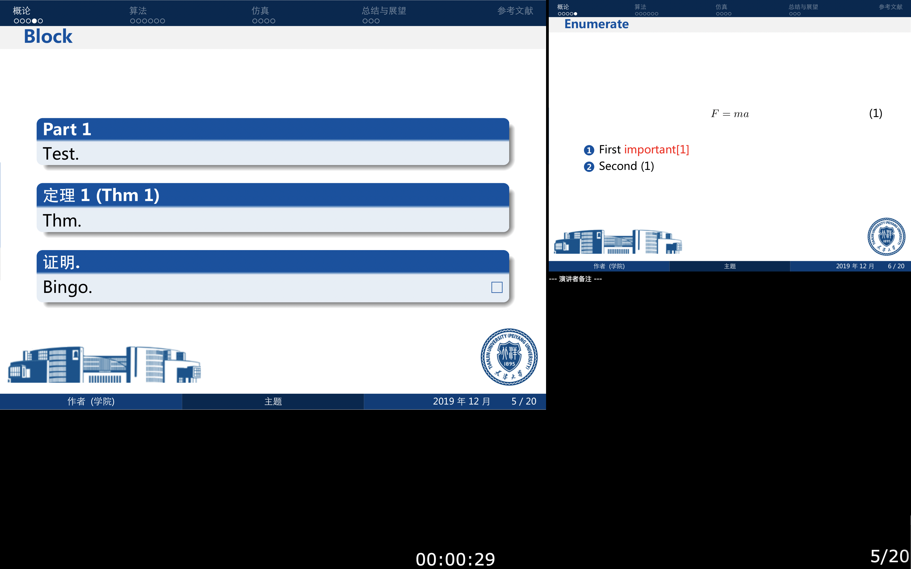

[English](../README.md) | 简体中文  
<p align="center"></p>
<!-- <p align="center"></p> -->
<h2 align="center">天津大学主题演示文稿制作模版</h2>
<p align="center"><b>基于Sublime Text 3、Skim、Latex、beamer组件、及Pdfpc 的PowerPoint(天津大学主题)制作及演示模版</b></p>
<!--  This is a template for making powerpoint of Tianjin University with latex + beam -->

## 目录
* [背景](#背景)
* [环境及初始化](#环境及初始化)
* [使用](#使用)
* [样例](#样例)
* [持有](#持有)
* [License](#License)


## 背景
之前做课程作业要写演示文稿，使用 Latex + Beamer 制作了一份。觉得很好用，所以整理了一遍，连同配置、背景主题、模版一起传上来，以便再用。  
写作业用latex，插入公式、插入代码、排版都比较精确和方便，打算之后整理一个模版上传一下。
## 环境及初始化
- 编写语言：LaTex  
- 编辑器使用：Sublime Text 3  
- 实时预览使用：Skim  
关于编辑器和Skim的下载和配置，参考：[配置Sumlime + Skim](https://www.jianshu.com/p/50a813c8a6ea)  

- beamer：LaTex里的一个package，用于编写和生成演示文稿。无需额外的配置，只用在.tex文件前面引入即可（模版中已包含）。    

此外，在编译好.tex文件后，生成的是.pdf的演示文稿文件。因macOS使用PDFkit进行渲染，它会在实际显示高分辨率渲染之前首先显示内容的低分辨率版本，因此使用一般的PDF 阅览器在播放时会呈现延迟，无法用来演示。  
而避免这种延迟的方法有几种，pdfpc就是其中我认为不错的一个。  

- pdfpc 安装：
``` applescript
brew install pdfpc
```

等待所有依赖安装即可。  
  
完成以上的工作，就可以做演示文稿和展示了。

#### 目录说明
```
├─ Background           //背景图片、标志
│  ├─ tju_background.png
│  └─ tju_logo.png
├─ makefile             //make clean 清理中间文件
├─ README.file          
│  ├─ README.CN.md      //中文readme
│  └─ *.png            
├─ README.md
├─ slides.pdf           //生成的演示文稿
├─ slides.tex           //LaTex源文件
├─ Support   
│  ├─ tju_color.sty     //自定义的Beamer模版(tju)
│  ├─ thesis.bib        //引用的论文信息
│  └─ pdfpcnotes.sty    //pdfpc演讲者注释模块（在演讲者界面显示note）
```


## 使用
- 打开源文件和同步展示界面  
1. 在Sublime text 3中打开`slides.tex`源文件；  
2. <kbd>shift</kbd>+<kbd>command</kbd>+<kbd>B</kbd> 呼出编译控制； <p align="center"></p> 
3. 选择 `LaTeX-XeLaTeX` 选项进行编译；  
4. 编译成功后自动弹出 Skim界面，将它们放在一起，如下： <p align="center"></p> 
- 根据所要展示的内容和效果，修改.tex源文件 
- 使用 <kbd>shift</kbd>+<kbd>command</kbd>+<kbd>B</kbd> + `XeLaTeX`  编译并查看演示文稿的效果 
- 使用pdfpc演示  
1. 在文件目录下使用命令  
``` applescript
pdfpc sliders.pdf
```
2. 渲染结束后，生成两个显示屏幕：
<p align="center"></p>
<p align="center"> "Audience Screen"
<p align="center"></p>
3.两个屏幕同步显示。演示者显示,包括下一张幻灯片,已用时间，备注等。
<p align="center"> "Presenter Screen"
<p align="center"></p>
<p align="center"> "Presenter Screen"  
     
4.演讲者备注通过在.tex文件中使用`\pnote{}`来产生，最终会显示在演示者屏幕的右下角（通过<kbd>command</kbd>+<kbd>+/—</kbd>调节字体大小），如：
<p align="center"></p>

## 样例
To see how the specification has been demonstrated, see the [Example](./slides.pdf "sliders.pdf")


## 维护者
[@Lilithh](https://github.com/Lilithh)


### License
-----------
[license@](http://www.tzga.gov.cn/news/zishou.aspx)
